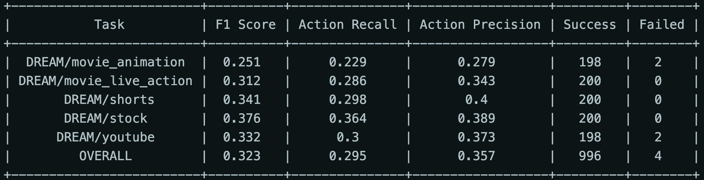
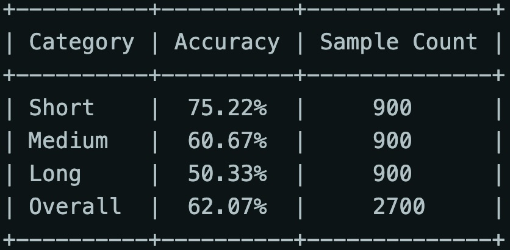

## DREAM-1K
### Download
```
git lfs install
git clone https://huggingface.co/datasets/omni-research/DREAM-1K
```

### Extra Packages
* update transformers (for llama3)
* huggingface_hub (login)

### Run prediction code
```
bash scripts/pred/dream1k.sh
```

* modify the argument in scripts/pred/dream1k.sh or or change the argument into $1, $2, ...
* add `--question` if you want to change the question prompt. **Default question**: Please provide a detailed description of the video, focusing on the main subjects, their actions, and the background scenes.
```
nproc_per_node=2
data_path="DREAM-1K/json/metadata.json"
video_folder="DREAM-1K/video/DREAM-1K_videos"
output_dir="outputs/dream1k"
output_name="dream1k_pred_results"
```

### Compute score with single gpu
```
bash scripts/pred/dream1k_eval.sh <pred_file> <output_dir> <huggingface_token>
```
* Change the export PATH to your env
```
export PATH=/mnt/home/kaipoc/miniconda3/envs/llava/bin:$PATH
```


### Compute score with multi gpu
```
bash scripts/pred/dream1k_eval_parallel.sh <pred_file> <output_dir> <huggingface_token>
```
* use --model_name to change the your backbone (default: `meta-llama/Meta-Llama-3.1-8B-Instruct`)
* use --debug to run with small dataset (default: `False`)
* expected output (will be saved in .txt file):


### Directly login huggingface
```
export PATH=/mnt/home/kaipoc/miniconda3/envs/llava/bin:$PATH
huggingface-cli login
enter your huggingface token
```

## Video-MME

### Download
required license, already available in ORD
### [UPDATED] Transribe subtitles into .txt format
```
bash scripts/pred/generate_videomme_subtitle.sh <video_path> <srt_path> <output_path>
```
* Please refer to Video-MME's raw data to access video_path and srt_path.

### Run full code
```
bash scripts/pred/videomme.sh
```
* You can add --use_subtitle and --subtitle_path to the script to use subtitle information.
* Change the argument if necessary. The process is identical to DREAM-1K.
* The output in terminal may be like following (This result will also be saved in a .txt file):


* prompt template:
```
Select the best answer to the following multiple-choice question based on the video{ and the subtitles}. Respond with only the letter (A, B, C, or D) of the correct option
{question}
A. {choice_A}
B. {choice_B}
C. {choice_C}
D. {choice_D}
The best answer is:
```
`{ and the subtitles}` will be added to the prompt if you use --use_subtitle.

## VidHal

### Dataset
directly assess annotation and raw videos in tp1's folder:
`/mnt/home/kaipoc/research_vh/LLaVA-NeXT/playground/VidHal/vidhal`

### Generate prediction
```
bash scripts/pred/vidhal/prediction.sh
```

### Evaluate score (accuracy)
```
bash scripts/pred/vidhal/evaluate.sh <pred_file> <gt_file> (<score_file>)
```
* `<score_file>` is optional, if not provided, it will be saved in the same directory as `<pred_file>`.
* the result with be saved in json file (five different types and overall accuracy).

## FactVC
### Download (Evaluation model checkpoint)
```
gdown --id 1S9T4-XLHMhRt3NW4NRQ3WflmEaEZ_H5I
```